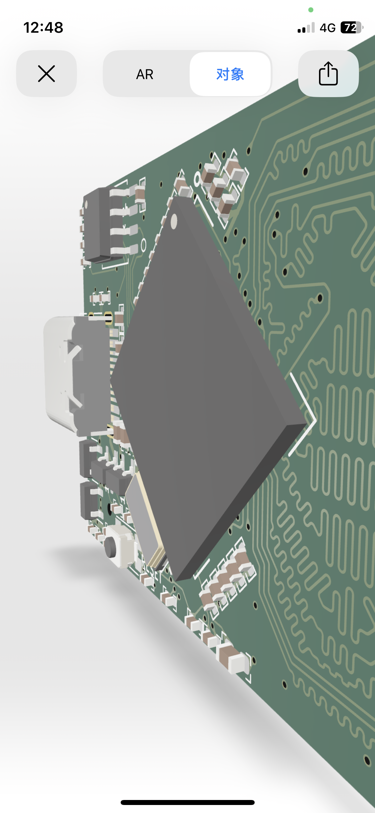

# PCB 3D Model Files

This dir contains all KiCad-geenrated wrl model files of SlimARM boards converted by Blender to Pixar USDZ model file.<br>
The USDZ(Universal Scene Decription, Zipped) model can be displayed directly on all iOS/macOS devices.<br>
If your device is iOS device(needed iOS version above 14), access <a href="slimarm_carambola_v1r0x202.usdz">slimarm_carambola_v1r0x202.usdz</a> to view the model.<br>
</img>

# Convert Method

1. KiCad(Pcbnew)->Export->VRML...
2. Blender->Import->X3D Extensible(.x3d/.wrl)<br>
Move the board to the original, Zoom, etc.
3. Blender->Export->Universal Scene Decription(.usd*)
4. zip the usdc to usdz
```shell
$ zip -0 output.usdz input.usdc
```