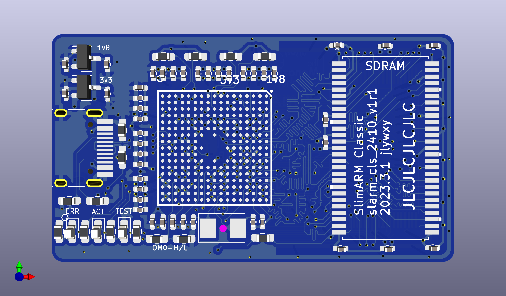

# Slimarm Classic 2410: bare-metal code execution and Linux research on S3C2410AL

This project is making a minimum S3C2410AL core board to run bare-metal code and Linux.
<br><br>
Author: jlywxy(jlywxy@outlook.com)<br>
Document Version: 2.1<br>

- --

## Project Status

```
[ok]pcb manufacturation and verification
[ok]openocd and jtag configurations 
[ok]KeilMDK/IAR toolchain bare-metal code compiling
[ok]openocd connect and debug
[ok]startup assembly explained and general concepts for arm startup sequences
[ok]gnu toolchain bare-metal assembly compiling
[ok]pcb with flash and dram stable version(slimarm classic)
[ok]pcb gerber sharing
[ok]gnu toolchain(arm-none-eabi-) bare-metal c code compiling

[failed]writing simple usb device CDC communication program
[ok]crosstool-ng toolchain on macOS(arm-unknown-linux-gnueabi-) and u-boot compiling
[failed]running Linux onboard, debugging via USBD
```
- --

## Processor Overview

Samsung S3C2410AL-20:<br>
* 16/32-bit(Little Endian) ARM920T RISC Arch
* ARM/Thumb mode
* JTAG debug
* internal 4kB Boot RAM(Steppingstone for NAND flash booting)
* 16kB I-Cache and 16kB D-Cache, MMU
* NAND & SDRAM support
* 1.8v internal voltage supporting max FCLK 200MHz
* on-chip PLL
* watchdog Timer
* 272-FBGA package (0.8mm pitch)
* 3.3v multiplexed I/O ports
* more but not related features...
- --

## S3C2410 Fail Part Problems
The workaround part of linux running on the board is in a stall state, since none of the proper u-boot version is found for s3c2410 to use USB Device as a console interface. u-boot seems never supported s3c2410 USB Device. The transition for UDC codes from linux to u-boot is hard to do. <br>
The fatal problem for USBD unablility is resulting from the board that did not extend any UART ports for u-boot to print debug messages.<br>
Since the processor is too old (in performance and arch) nowadays and <b>lack of support</b>, this part of project is marked with EOL, and not designing and revising new boards with 2410.<br>
<b>The day the usb device stuff is able to run on slimarm classic 2410, only the day the project starts again.</b><br>
As a result, The whole project is putting more attention on those advanced processors, see part SlimARM Zero/Fusion.

- --
## Making the core board for S3C2410

Note: This project is now testing the new designed core board `slimarm classic 2410 v1r1` with:<br>
* 32 MBytes SDRAM(tuned line length)
* 32 MBytes NAND flash(used for nand boot)



PCB Design Suggestions:
1. Make sure pins unwanted has been properly pulled-up or down according to S3C2410 datasheet.
2. When soldering S3C2410 onto the board, use heat gun <b>BELOW 300 C</b> temperature, otherwise the chip will damage.
3. When using 16 bit memory chips, connect chip address line A0 to CPU A1, and so on.
4. Enlarge the width of power lines as it could. Use 2.0v LDO instead of 1.8v LDO.
5. Satifsy "3W" wiring rule everywhere except of BGA area.
6. Make small components the same direction for easy soldering.

For more design points, see <a href="slimarm_classic_2410.md">slimarm_classic_2410.md</a>
- --

## Compiling LED-blinking code using arm-none-eabi- toolchain

1. Writing startup code<br>

* Init interrupt vectors<br>
* Jump to main (function of blinking LED)<br>
```asm
.text
    b _reset
    ldr pc, _undef
    ldr pc, _softir
    ldr pc, _abpre
    ldr pc, _abdat
    ldr pc, _reserved
    ldr pc, _irq
    ldr pc, _fiq
_reset:
    b main
```
https://stackoverflow.com/questions/18848776/what-does-label-word-label-mean-in-arm-assembly<br>

* Init arm modes and stacks(This part is still under working)<br>

Note: when loading 32bit immediate number to register, use `ldr Rn, =0xnum`:<br>
https://developer.arm.com/documentation/dui0473/j/writing-arm-assembly-language/load-32-bit-immediate-values-to-a-register-using-ldr-rd---const?lang=en<br>

2. Make and link

```shell
$ arm-none-eabi-as -mcpu=arm920t -o main.o main.s
$ arm-none-eabi-ld -T link.lds -o main.elf main.o
```
Note: the `.text` segment need to be linked to `0x40000000`. The linker script should look like this:<br>
```
SECTIONS {
    . = 0x40000000;
    .text : { * (.text); }
}
```
For the usage of linker script, check http://bravegnu.org/gnu-eprog/lds.html<br>

3. Check compiled executable in assembly and hex<br>
* Use arm-none-eabi-objdump to read startup code and c code assembly.<br>
```shell
$ arm-none-eabi-objdump -D /path/to/elf
```
Note: do not use objdump to read `.comment` section, use readelf instead.<br>
```shell
$ arm-none-eabi-readelf -p .comment /path/to/elf
```
* Use arm-none-eabi-objcopy to convert elf to hex(executable ihex,which represents the real binary stream content stored in memory chips), if another selected flash program is using hex files.<br>
```shell
$ arm-none-eabi-objcopy -O ihex /path/to/elf /path/to/hex
```

- --

## Connecting to the chip
1. This project uses a cheap cloned Altera USB Blaster as a JTAG programmer, because openocd has support for it and S3C2410 do not support SWD.

2. A custom openocd cfg file should be created.
checkout <a href="slimarm_classic_2410.cfg">slimarm_classic_2410.cfg</a>
- --

## Chip Boot Sequence

1. Before NAND takes place, OM[1:0] was set to 01 for not booting from NAND Flash and set Boot RAM bus width to 32bits. Simutaneously the address of Boot RAM is determined to 0x40000000.<br>Otherwise, the Boot RAM is linked to 0x0.
OM[3:2] was set to 00 to use Crystal(12MHz with two 22pF caps) for UPLL and MPLL clock input.

2. the Boot RAM (called as Steppingstone) is a piece of internal RAM region in the chip used for automatically copying boot code in NAND Flash to execute in place, which starts at 0x00000000. If ROM like NOR Flash is used, then the chip also starts at 0x00000000, fetching instructions from NOR directly.

3. When chip was powered on, it starts from Boot RAM or NOR (0x00000000), where interrupt vectors is set. Then it will <b>jump to the label for initializing each arm modes and their stack spaces, disabling IRQs, then environment is ready</b> to execute from c code `main`.<br>
https://developer.arm.com/documentation/dui0471/m/embedded-software-development/stack-pointer-initialization

- -- 

## Uploading compiled code to Boot RAM

1. Start openocd using previous created cfg file, connect to openocd CLI using telnet at port 4444. <br>
Then use openocd "load_image" command as follow:<br>
`load_image /path/to/elf(or axf or hex)`<br>
which means filling Boot RAM with selected program image.

2. start code execution:<br>
`resume 0x40000000`<br><br>
Note: when linker was not setting `.text` segment to correct address at 0x40000000, the program will not work.<br>
Because some of the constants are not calculated correctly based on the `.text` starting address. <br>
For more details, use `arm-none-eabi-objdump -d /path/to/elf` to differ the two compiled executives in <a href="link_problem_example">link_problem_example</a>, in where contains one elf linked `.text` to 0x0 and the other elf linked `.text` to 0x40000000.
In this environment, neither `b/bl :label/#num`,`ldr pc,[pc,#num]` nor `(openocd)resume #num` points real instruction address + 4. Use their real address when branching.

- --

## Misc

<--To Be Continued-->

1. Document Patch and Errata
* Added peripheral operation concepts in "Writing and Compiling code using Keil MDK 5"<br>
* Modified "BootROM" to "Boot RAM" in the whole article.<br>
* Added Boot RAM definition in "S3C2410AL Boot Concepts"<br>
* Added performance test method and knowledge bases in "Misc".<br>
* Added openocd init method and single-line-configuration(with arm machine code explained) in "Uploading compiled code to Boot RAM"<br>
* Corrected single-line-configuration, in which PLL conf command was set to more stable value. Corrected contents of machine code explained.
* Added paragraph "Processor Overview"<br>

patch above: jlywxy@2023.1.19<br>

* Added paragrapg "Project Status"<br>
* Modified "Connecting to the chip".2: added "bindto 0.0.0.0" for IAR remote gdb debug connection.<br>
* Modified "Writing and Compiling code using ~~Keil MDK 5~~ IAR 9" content for IAR usage.<br>
* Implemented "Processor Overview"<br>

patch above: jlywxy@2023.1.25<br>

* Modified Severe Error: in "Uploading compiled code to Boot RAM", after code loaded, openocd resuming from 0x40000000 rather than 0x40000004, which indicates a former linking problem: .text was linked to 0x0 and written to 0x40000000, therefore contents of constant data may be malformed. <br>

errata above: jlywxy@2023.1.26<br>

* Updated project status; adding PCB project files. <br>

patch above: jlywxy@2023.1.28<br>

* Changed the direction of the project.

patch above: jlywxy@2023.1.30<br>

* Modified PCB design problem. <br>
fixed sdram wiring problem; removed nor flash; added sdcard slot.

patch above: jlywxy@2023.2.5<br>

* Committed new PCB design and corrected PCB design points, corrected Chip boot concepts.

patch above: jlywxy@2023.3.1<br>

* Marked slimarm classic 2410 workaround state.

patch above: jlywxy@2023.3.11<br>

